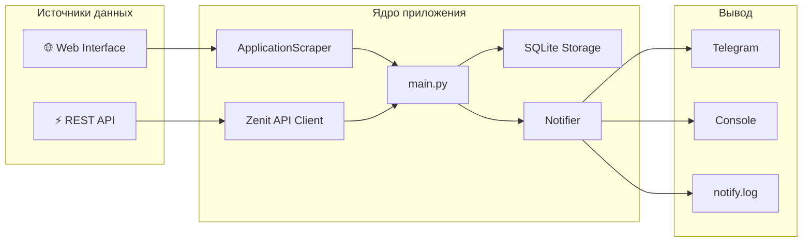
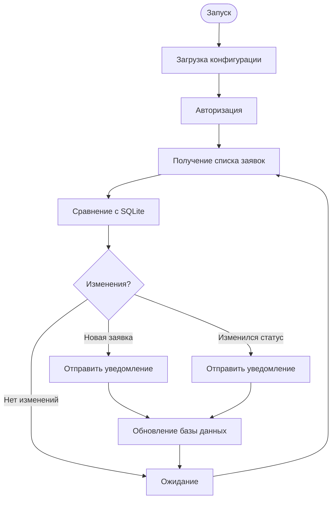
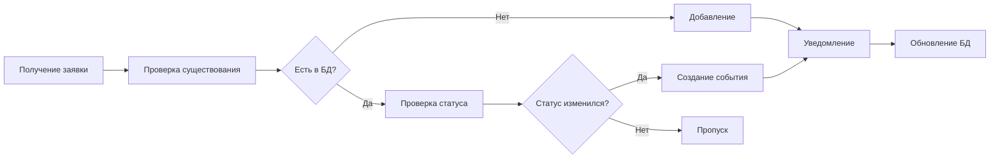
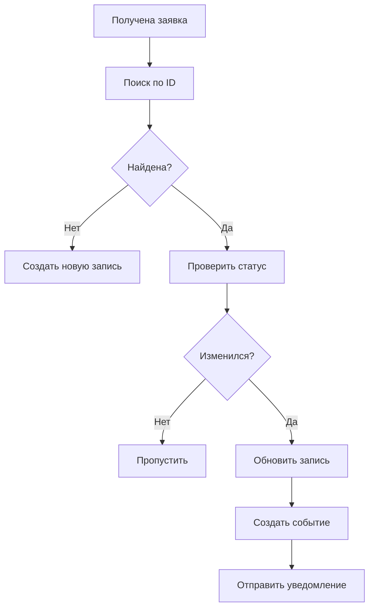
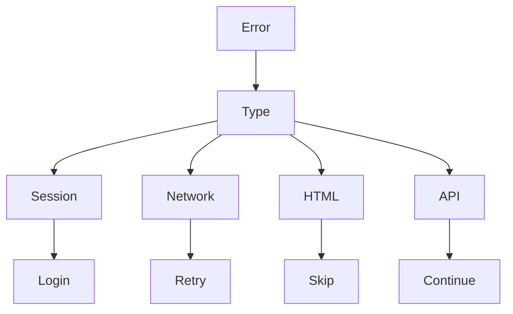
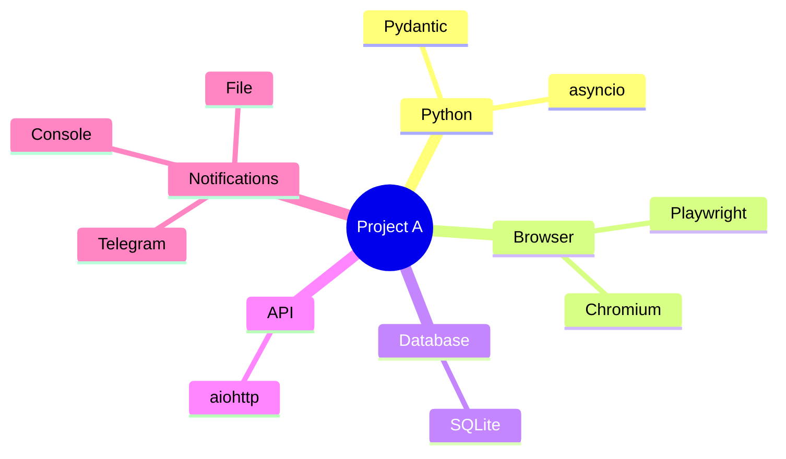

<div align="center">


# 🚗 Project «A»

### Automated Auto Loan Monitoring

<p align="center">
Автоматический мониторинг заявок автокредитования с использованием <b>Playwright</b>, <b>Telegram Bot API</b> и <b>SQLite</b>.
</p>

<br>


<br>


</div>

---

# ✨ Overview

Project A  — это интеллектуальная система автоматического мониторинга заявок автокредитования, предназначенная для непрерывного отслеживания изменений статусов, получения условий одобрения и моментального уведомления сотрудников через Telegram.

В основе проекта лежит полностью автоматизированный процесс взаимодействия с банковской системой. После запуска приложение самостоятельно проходит авторизацию, поддерживает активную сессию, получает список заявок, анализирует изменения, сохраняет историю в локальной базе данных и отправляет уведомления только при появлении действительно важных событий.

Проект построен с упором на надежность, автономность и возможность круглосуточной работы на сервере без вмешательства пользователя.

---

# 🚀 Основные возможности

<table>
<tr>
<td width="50%">

### 📋 Мониторинг заявок

- Автоматическая проверка новых заявок
- Отслеживание изменения статусов
- Получение истории изменений
- Работа в непрерывном цикле

</td>

<td width="50%">

### 📱 Telegram

- Моментальные уведомления
- Отправка условий кредита
- Красивое форматирование сообщений
- Защита от повторных уведомлений

</td>
</tr>

<tr>
<td>

### 🔐 Безопасность

- Авторизация по логину и паролю
- Поддержка двухфакторной аутентификации (TOTP)
- Автоматическое восстановление сессии
- Headless режим

</td>

<td>

### 💾 Хранение данных

- SQLite
- История заявок
- История статусов
- История уведомлений
- Кэш состояний

</td>
</tr>
</table>

---

# 🎯 Для чего создан проект

Основная задача Project A — полностью исключить необходимость ручного мониторинга банковской системы.

Вместо постоянного обновления страницы сотрудник получает уведомление только тогда, когда произошло действительно важное событие:

- появилась новая заявка;
- изменился статус;
- заявка была одобрена;
- стали доступны условия кредитования;
- возникла ошибка авторизации.

Таким образом значительно сокращается время реакции на изменения и уменьшается вероятность пропустить важную информацию.

---

# 🌟 Ключевые преимущества

| Возможность | Описание |
|-------------|----------|
| ⚡ Полностью автоматическая работа | Не требует постоянного контроля пользователя |
| 🔄 Непрерывный мониторинг | Проверка заявок по заданному интервалу |
| 🔐 Поддержка TOTP | Работа с двухфакторной авторизацией |
| 📱 Telegram интеграция | Уведомления в режиме реального времени |
| 💾 SQLite | Не требует установки сервера БД |
| 🚀 Высокая скорость | Playwright обеспечивает быстрое взаимодействие с системой |
| 📊 История изменений | Все изменения сохраняются в базе данных |
| 🛡 Защита от дублей | Повторные уведомления автоматически исключаются |

---

# 🏗 Архитектура

Project A построен по модульному принципу.

Каждый компонент отвечает только за одну задачу, благодаря чему проект легко расширяется, тестируется и сопровождается.



---

## Архитектурные принципы

Проект разделён на независимые компоненты.

| Компонент | Назначение |
|------------|------------|
| **Scraper** | Получение данных через браузер |
| **API Client** | Получение данных через REST API |
| **Storage** | Работа с SQLite |
| **Notifier** | Отправка уведомлений |
| **Telegram Bot** | Управление и команды |
| **Config** | Загрузка параметров из `.env` |
| **Main** | Координация работы приложения |

Такое разделение позволяет без изменений основной логики добавлять новые банки, новые способы уведомлений или альтернативные базы данных.

---
```

---

# 📂 Project Structure


📦 Project A
│
├── 📂 bot
│   │
│   ├── 🔐 auth.py
│   ├── 🧠 notifier.py
│   ├── 📊 report.py
│   ├── 🌐 scraper.py
│   ├── 💾 storage.py
│   ├── 📱 telegram_client.py
│   ├── 🤖 telegram_commands.py
│   ├── 🔑 totp_utils.py
│   ├── 🏦 zenit_client.py
│   ├── 📄 zenit_conditions.py
│   ├── 🚦 zenit_statuses.py
│   ├── ⚙ config.py
│   └── ...
│
├── 📂 data
│   ├── applications.db
│   ├── sessions
│   └── cache
├── 📜 main.py
├── 📜 requirements.txt
├── 📜 README.md
└── 📜 .env
```

---

# 🧩 Core Components

<table>

<tr>

<td width="25%" align="center">

## 🔐

### Authentication

Авторизация

Логин

Пароль

TOTP

Session Restore

</td>

<td width="25%" align="center">

## 🌐

### Scraper

Playwright

Получение заявок

Получение условий

Парсинг страниц

</td>

<td width="25%" align="center">

## 💾

### Storage

SQLite

История

Статусы

Кэш

</td>

<td width="25%" align="center">

## 📱

### Notifications

Telegram

Console

Logs

Форматирование

</td>

</tr>

</table>

---

# ⚙ Принцип работы

Во время работы приложение непрерывно выполняет один и тот же цикл.



---

# 🔄 Pipeline обработки заявки

Каждая заявка проходит несколько этапов обработки.




# 💾 Database Structure

```text
┌──────────────────────────────┐
│        Applications          │
├──────────────────────────────┤
│ id                           │
│ application_number           │
│ customer_name                │
│ current_status               │
│ created_at                   │
│ updated_at                   │
│ conditions                   │
└──────────────────────────────┘

             │

             ▼

┌──────────────────────────────┐
│        Status History        │
├──────────────────────────────┤
│ application_id               │
│ old_status                   │
│ new_status                   │
│ changed_at                   │
└──────────────────────────────┘

             │

             ▼

┌──────────────────────────────┐
│      Notifications           │
├──────────────────────────────┤
│ application_id               │
│ message                      │
│ sent_at                      │
│ telegram_message_id          │
└──────────────────────────────┘
```

---

# 🧠 Логика сравнения

После получения списка заявок начинается сравнение с локальной базой данных.



---


# 🧪 Development Mode

Для разработки рекомендуется

```env
HEADLESS=false

LOG_LEVEL=DEBUG

CHECK_INTERVAL_SECONDS=15
```

Так значительно удобнее отслеживать работу Playwright.

---
# ❓ Frequently Asked Questions

<details>
<summary><b>Почему используется Playwright вместо Selenium?</b></summary>

Playwright значительно быстрее, стабильнее и лучше работает с современными веб-приложениями.

Он автоматически ожидает появления элементов, корректно обрабатывает JavaScript и позволяет надежно работать в Headless режиме.

</details>

---

<details>

<summary><b>Почему используется SQLite?</b></summary>

SQLite не требует отдельного сервера базы данных.

Для данного проекта она обеспечивает:

- высокую скорость;
- простоту резервного копирования;
- надежность;
- отсутствие дополнительных зависимостей.

</details>

---

<details>

<summary><b>Можно ли использовать PostgreSQL?</b></summary>

Да.

Архитектура проекта позволяет заменить слой хранения данных практически без изменений остальной логики.

Поддержка PostgreSQL планируется в следующих версиях.

</details>

---

<details>

<summary><b>Как изменить интервал проверки?</b></summary>

Измените переменную

```env
CHECK_INTERVAL_SECONDS=60
```

в файле `.env`.

</details>

---


<details>

<summary><b>Можно ли мониторить несколько банков?</b></summary>

Да.

Архитектура изначально проектировалась таким образом, чтобы можно было добавить новые адаптеры банков без изменения основного приложения.

</details>

---

# 🛡 Обработка ошибок

Во время работы приложение автоматически восстанавливается после большинства ошибок.



---


---

# 🤝 Contributing

В настоящий момент проект является частной разработкой.

Тем не менее предложения по улучшению архитектуры, оптимизации производительности и расширению функциональности всегда приветствуются.

Если вы обнаружили ошибку или хотите предложить новую возможность, создайте Issue или Pull Request.

---

## Стек проекта



---

# 📈 Roadmap

## ✅ Реализовано

- [x] Мониторинг заявок
- [x] Авторизация через браузер
- [x] Работа через REST API
- [x] SQLite
- [x] Telegram-уведомления
- [x] История изменений
- [x] Поддержка нескольких автосалонов
- [x] Кэширование условий банка
- [x] Автоматическая повторная авторизация
- [x] Логирование
- [x] Настройка через `.env`

---

## 🚀 Планируется

- [ ] Web Dashboard
- [ ] WebSocket уведомления
- [ ] Экспорт статистики в Excel
- [ ] REST API для внешних сервисов


---

# 📄 License

```text
Copyright (c) 2026

All Rights Reserved.

This repository is intended for educational,
internal and demonstration purposes only.

Unauthorized commercial use is prohibited.
```

---

# 💙 Acknowledgments

Проект создан с использованием следующих технологий:

- Python
- Playwright
- SQLite
- Telegram Bot API
- dotenv

Отдельная благодарность разработчикам open-source библиотек.

---

<div align="center">

# ⭐ Star the Repository

Если проект оказался интересным — поставьте ⭐ репозиторию.

Это помогает развитию проекта и мотивирует на дальнейшие улучшения.

<br>

---

### 🚗 Project A

**Automated Auto Loan Monitoring Platform**

Made with ❤️ by **Daniil Lebedev**


<br><br>

**© 2026 Project A**

</div>
